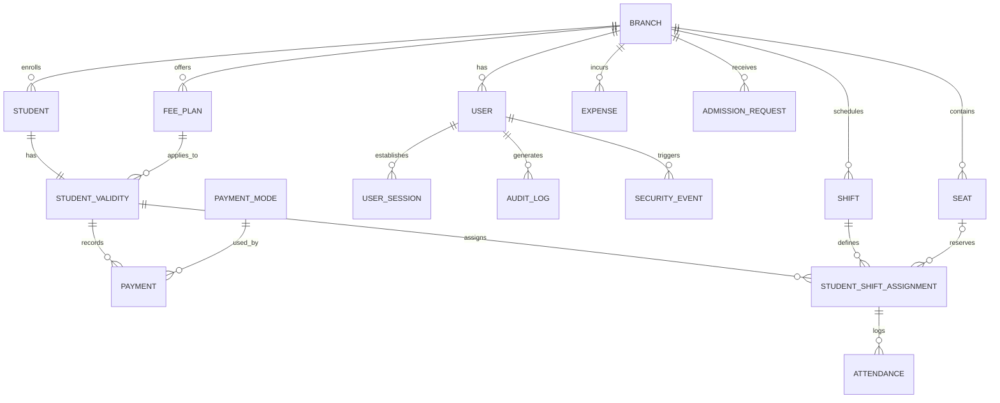

# 📚 Modern Library Management System (LMS)

A production-grade, SaaS-ready **Library Management System** built with **React 19 (Vite)** on the frontend and **Node.js (Express) + Prisma ORM** on the backend. Designed specifically for modern study libraries, co-working reading halls, and multi-shift student study spaces.

---

## 🌟 Key Highlights & System Overview

- **Multi-Tenant / Branch Architecture**: Clean isolation of branches, members, seats, shifts, fee plans, staff, and expenses.
- **Role-Based Access Control (RBAC)**: Support for `OWNER` and `STAFF` roles with dynamic URL prefix routing (`/:role/:name/dashboard`).
- **Comprehensive Device & Session Security**: Single-device concurrent session enforcement, failed login lockouts, and security audit logs.
- **SaaS Subscription & Payment Gateway**: Tier-based SaaS billing (Starter, Basic, Pro, Enterprise) powered by **Razorpay**, promotional coupons, automated renewal queueing, and PDF invoices.
- **Shift & Seat Allocation Engine**: 10-column interactive seat layout, shift timing enforcement, and prevention of double-booking.
- **Dual Attendance Portals**: In-system staff check-in panel with a live "In-Library" monitor plus a standalone, fast Public Kiosk (`/public-attendance`) with auto-timeout.
- **Financial & Operational Management**: Instant cashier fee collection desk (`/collect-fee`), recurring validities, expense tracking, and revenue analytics.

---

## 🏗️ System Architecture

```
┌─────────────────────────────────────────────────────────────────────────────┐
│                            FRONTEND (React 19 + Vite)                       │
│                                                                             │
│   ┌───────────────┐ ┌───────────────┐ ┌───────────────┐ ┌───────────────┐   │
│   │   Dashboard   │ │   Admission   │ │ Member Portal │ │  Collect Fee  │   │
│   │  & Real-Time  │ │ (Staff / Pub) │ │  & Profiles   │ │ (Cashier Desk)│   │
│   └───────┬───────┘ └───────┬───────┘ └───────┬───────┘ └───────┬───────┘   │
│   ┌───────┴───────┐ ┌───────┴───────┐ ┌───────┴───────┐ ┌───────┴───────┐   │
│   │  Attendance   │ │ Seat / Shift  │ │   Expenses    │ │ Subscriptions │   │
│   │ (Staff/Kiosk) │ │  Allocation   │ │  & Analytics  │ │ & Invoicing   │   │
│   └───────────────┘ └───────────────┘ └───────────────┘ └───────────────┘   │
│                                     │ Axios Client                          │
│                                     │ Bearer Token + Device-ID              │
└─────────────────────────────────────┼───────────────────────────────────────┘
                                      │ HTTP / REST API (Port 5000)
┌─────────────────────────────────────┼───────────────────────────────────────┐
│                       BACKEND (Node.js + Express 5)                         │
│                                                                             │
│   ┌─────────────────────────────────────────────────────────────────────┐   │
│   │                     Security & Auth Middlewares                     │   │
│   │  • In-Memory Rate Limiter     • Device Session Validation (Single)  │   │
│   │  • JWT Auth & Account Lockout • Subscription Expiry Enforcement     │   │
│   └──────────────────────────────────┬──────────────────────────────────┘   │
│                                      │                                      │
│   ┌──────────────┐ ┌──────────────┐ ┌┴─────────────┐ ┌──────────────────┐   │
│   │ Auth & Users │ │ Students &   │ │ Payments &   │ │   Attendance &   │   │
│   │  Controller  │ │  Validities  │ │ Razorpay Sub │ │ Shifts / Seats   │   │
│   └──────────────┘ └──────────────┘ └──────────────┘ └──────────────────┘   │
│                                      │                                      │
│                              Prisma ORM Client                              │
└──────────────────────────────────────┼──────────────────────────────────────┘
                                       │
┌──────────────────────────────────────┴──────────────────────────────────────┐
│                    DATABASE (Prisma ORM: SQLite / PostgreSQL)                │
│                                                                             │
│  [Branch] ──┬──< [Users] ───────< [UserSessions] & [AuditLogs]              │
│             ├──< [Students] ────< [StudentValidities] ──< [Payments]        │
│             │                          │                                    │
│             ├──< [Seats]               └──< [StudentShiftAssignments]       │
│             │                                       │                       │
│             ├──< [Shifts] ──────────────────────────┴──< [Attendance]       │
│             ├──< [FeePlans]                                                 │
│             ├──< [Expenses]                                                 │
│             └──< [AdmissionRequests]                                        │
└─────────────────────────────────────────────────────────────────────────────┘
```

---

## 💻 Tech Stack

### Frontend
- **Framework**: [React 19](https://react.dev/) with [Vite](https://vitejs.dev/)
- **Routing**: [React Router DOM v7](https://reactrouter.com/) (Dynamic nested role routes)
- **Styling**: Vanilla CSS & Custom Design System (Dark/Light mode support via `ThemeContext`)
- **Icons**: [React Icons](https://react-icons.github.io/react-icons/) (FontAwesome)
- **Document Exporting**: [jspdf](https://github.com/parallax/jsPDF) & [html2canvas](https://html2canvas.hertzen.com/)
- **Scanner / Hardware Support**: [html5-qrcode](https://github.com/mebjas/html5-qrcode) & [qrcode](https://github.com/soldair/node-qrcode)
- **HTTP Client**: Axios with interceptors for automatic Bearer JWT and `X-Device-Id` injection

### Backend
- **Runtime**: [Node.js](https://nodejs.org/) & [Express 5](https://expressjs.com/)
- **ORM & Data Layer**: [Prisma ORM v7](https://www.prisma.io/) (SQLite default, seamless PostgreSQL switch)
- **Authentication**: JSON Web Tokens (JWT) + BCrypt password hashing
- **Security & Reliability**: In-memory IP rate limiting, active session verification, CORS whitelisting
- **Payment Processing**: [Razorpay Node SDK](https://razorpay.com/) for subscription checkouts & signature validation
- **Mailing**: [Resend](https://resend.com/) integration for transactional notifications

---

## 🚀 Core Features & Business Logic

### 1. Dynamic Authentication & Security
- **Role-Based Routing**: After login, users are routed to their personal role path: `/:role/:userName/dashboard` (e.g., `/owner/john-doe/dashboard` or `/staff/alex/dashboard`).
- **Single-Device Enforcement**: Each user session generates and verifies a unique `deviceId`. Logging in from a second browser/device logs out the previous session.
- **Brute Force Lockout**: Accounts lock automatically for a cooldown period after consecutive failed login attempts.
- **Mandatory First Login Password Change**: Owners flagged with `mustChangePassword` are constrained to `/change-password` before accessing operational pages.
- **Subscription Expiry Interceptor**: When a library subscription lapses, write operations (POST, PUT, DELETE) are blocked across all branch users, allowing only dashboard viewing and renewal actions.

### 2. Dashboard (`/:role/:name/dashboard`)
- **Live Metric Cards**:
  - Total Members, Active Members, Occupied Reserved Seats, Suspended Students, Today's Attendance, and Expiring Soon (within 7 days).
  - **Drilldown Modals**: Clicking any metric card opens a modal listing all matching students with direct links to profiles.
- **Interactive Seat Availability**: Live visualization of available vs. occupied seats across all active shifts.
- **Revenue Analytics**: Year-selectable bar chart comparing monthly collections.
- **Recent Payments Ledger**: Quick view of latest student fee payments.
- **Notification Center**: Bell icon showing urgent alerts (expiring memberships, new pending admission requests).

### 3. Admission & Registration (`/:role/:name/admission`)
- **Automated Identifiers**: Auto-generates student codes (e.g., `LI00001`) and monthly registration numbers (e.g., `20260900001`).
- **One-Shot Transactional Onboarding**:
  - Captures personal details (Photo, Name, Gender, Mobile, Email, DOB, Aadhaar, Address).
  - Selects Fee Plan (duration, fee, registration fee) and study shift.
  - Chooses Access Type: **Reserved** (forces seat selection from interactive grid) or **Unreserved**.
  - Collects initial fee (Cash / UPI with mandatory UTR number).
  - Creates `Student` + `StudentValidity` + `StudentShiftAssignment` + `Payment` atomically.
- **Public Admission Landing (`/public-admission`)**: An unauthenticated portal for students to register online or scan QR codes from entrance posters.

### 4. Member Management (`/:role/:name/students`)
- **Search & Filtering**: Search in real time by name, student code, registration number, or mobile number.
- **Complete Profile Modal**:
  - Basic bio and Aadhaar details.
  - Current validity status with start/end date and remaining days.
  - Shift and seat assignment history.
  - Complete payment and invoice history.
- **Lifecycle Actions**: Soft deletion (marks account as `DELETED` and preserves financial records), suspension, and profile edits.

### 5. Quick Cashier Desk (`/:role/:name/collect-fee`)
- Specially optimized for front-desk library operations:
  - Instant live search of students by code or phone number.
  - Displays remaining validity days and warns of expired/expiring memberships.
  - One-click renewal plan selection with auto-calculated start and end dates.
  - Instant invoice number generation with Cash or UPI (UTR tracking) options.
  - Printable and downloadable payment receipts.

### 6. Dual Attendance System
- **Admin/Staff Attendance (`/:role/:name/attendance`)**:
  - Student code search with assigned shift and seat verification.
  - **Shift Window Verification**: Enforces that check-in only occurs within the student's assigned shift time.
  - **Live "In Library" Sidebar**: Real-time counter of students currently checked in; supports individual check-out or a 1-click **"Checkout All"** batch action.
- **Public Kiosk Attendance (`/public-attendance`)**:
  - Unauthenticated, lightweight kiosk mode designed for tablet stands at library doors.
  - Students enter their Student Code or Mobile Number.
  - Automatically identifies whether to Check-In or Check-Out based on current state.
  - Displays success confirmation with student photo and seat details, and automatically resets after a 5-second countdown.

### 7. Seat & Shift Management
- **Seats (`/:role/:name/seats`)**:
  - Bulk seat generator supporting custom alphanumeric ranges (e.g., `1-100`, `A1-A50`).
  - Room, Floor, and Section categorization.
  - Interactive grid displaying Available (Green), Occupied (Red/Orange), and Inactive states.
  - Bulk deletion, renumbering, and seat activation toggling.
- **Shifts (`/:role/:name/shifts`)**:
  - Define custom shifts (e.g., Morning, Afternoon, Evening, Full Day, Night).
  - Configurable start and end times in 12h / 24h formats.
  - Delete protection preventing removal of shifts currently assigned to active students.

### 8. Fee Plans (`/:role/:name/fee-plans`)
- Configure standard recurring subscription packages.
- Configurable parameters: Plan Name, Duration (Days), Fee Amount, One-Time Registration Fee, and Plan Type (Reserved / Unreserved).
- Deactivation and permanent deletion safeguards for plans associated with historical records.

### 9. Expense Tracking (`/:role/:name/expenses`)
- Record and track monthly operational costs.
- Categorization: Rent, Electricity, Internet, Maintenance, and Other.
- Financial overview cards: Total Expenses, Month-to-Date, and Category-wise breakdown.
- Date, month, and year filtering for accurate tax and profit calculations.

### 10. Reports & Business Intelligence
- **Daily Attendance Report (`/:role/:name/reports/daily-attendance`)**:
  - Filter daily attendance logs by calendar date.
  - View check-in/out timestamps, shift snapshots, and attendance remarks.
- **Revenue Analysis Report (`/:role/:name/reports/revenue`)**:
  - Visual monthly revenue breakdown.
  - Comparison of collections across Cash vs. UPI vs. Online payment modes.

### 11. SaaS Subscriptions & Billing (`/:role/:name/subscription`)
- **Tiers Available**:
  - **Starter**: Up to 150 active students (Basic reports, manual admission, single branch).
  - **Basic (Pro 100)**: Up to 250 active students (Advanced revenue analytics, priority support).
  - **Pro (Pro 200)**: Up to 500 active students (Multi-shift optimization, 24/7 SLA).
  - **Enterprise**: Unlimited students and multi-branch management.
- **Billing Cycles**: Monthly, Quarterly, and Half-Yearly options.
- **Promotional Coupon System**: Discount codes (e.g., `PRO1`) validated securely server-side.
- **Advance Plan Queueing**: Subscriptions purchased before expiration are queued as `pendingTier` and automatically activated when the active tier expires.
- **Subscription Invoices (`/:role/:name/subscription/invoice`)**: Official tax invoices with instant PDF download and print capabilities.

### 12. Settings & Staff Management (`/:role/:name/settings`)
- **Staff Accounts**: Library owners can invite staff with name, email, and temporary passwords, reset staff credentials, and remove staff members.
- **Appearance & Localization**: Dark mode toggle and 12-hour (AM/PM) vs. 24-hour time display preferences.
- **Security**: Current user password update and owner account self-deletion.

---

## 🗄️ Database Schema Overview



### Key Models in `prisma/schema.prisma`

| Model | Purpose |
|---|---|
| **Branch** | Multi-tenant library branch isolation |
| **User** | System users (`OWNER`, `STAFF`) with subscription and device metadata |
| **UserSession** | Concurrent device tracking ensuring single active login |
| **Student** | Student bio, code, registration number, and status (`ACTIVE`, `SUSPENDED`, `DELETED`) |
| **StudentValidity** | Active membership validity period, fee plan, and start/end dates |
| **StudentShiftAssignment** | Joins validity with shifts and reserved seats |
| **Seat** | Library seats with floor, room, and section attributes |
| **Shift** | Study shifts with start and end times |
| **FeePlan** | Pricing packages with duration and registration fees |
| **Payment** | Fee payments with invoice numbers, payment modes, and UTR tracking |
| **Attendance** | Check-in and check-out logs with shift timing snapshots |
| **Expense** | Operational expenses (Rent, Electricity, Maintenance, etc.) |
| **AdmissionRequest** | Public online admission request queue awaiting staff review |
| **AuditLog & SecurityEvent** | Comprehensive activity tracking and security event logging |

---

## 🔌 API Reference Guide

### Authentication & Users (`/api/users`)
- `POST /api/users/login` - Authenticate user, verify device, issue JWT
- `POST /api/users/logout` - Invalidate current device session
- `POST /api/users/forgot-password` - Generate password reset token
- `POST /api/users/reset-password` - Reset password with valid token
- `GET /api/users/profile` - Fetch current user & subscription details
- `PUT /api/users/profile` - Update profile name and contact information
- `PUT /api/users/change-password` - Update account password
- `POST /api/users/activate-pending-plan` - Instantly activate queued subscription
- `GET /api/users/staff` - List branch staff members (Owner only)
- `POST /api/users/staff` - Create new staff user account
- `PUT /api/users/staff/:id/password` - Reset staff password
- `DELETE /api/users/staff/:id` - Remove staff account

### Dashboard (`/api/dashboard`)
- `GET /api/dashboard/stats` - Summary KPI metrics
- `GET /api/dashboard/revenue?year=` - Monthly revenue breakdown
- `GET /api/dashboard/recent-payments?limit=` - Recent fee transactions
- `GET /api/dashboard/seat-availability` - Real-time seat occupancy by shift
- `GET /api/dashboard/notifications` - Urgent alerts and action items
- `GET /api/dashboard/stats-students?metric=` - Drilldown list of students for a metric

### Students (`/api/students`)
- `GET /api/students` - List all active branch students
- `GET /api/students/search?q=` - Search by name, code, or mobile
- `GET /api/students/next-code` - Get next auto-increment student code & reg no
- `GET /api/students/:id/profile` - Full profile with validity, shifts, and payments
- `POST /api/students/admit` - Atomic one-shot admission transaction
- `PUT /api/students/:id` - Update student profile details
- `DELETE /api/students/:id` - Soft-delete student record

### Attendance (`/api/attendance`)
- `GET /api/attendance` - List attendance records
- `GET /api/attendance/search?q=` - Search student and get today's attendance state
- `GET /api/attendance/active` - List currently checked-in students
- `POST /api/attendance/check-in` - Perform check-in (validates shift hours)
- `POST /api/attendance/check-out` - Perform check-out
- `POST /api/attendance/checkout-all` - Check out all currently present students
- `GET /api/attendance/public-search?q=` - Kiosk student lookup (rate-limited)
- `POST /api/attendance/public-checkin` - Kiosk quick check-in / check-out

### Payments & Razorpay (`/api/payments`)
- `GET /api/payments` - Transaction ledger
- `POST /api/payments` - Record fee payment
- `POST /api/payments/record` - Transactional validity renewal + payment creation
- `POST /api/payments/razorpay/create-order` - Create Razorpay subscription order
- `POST /api/payments/razorpay/verify-signature` - Verify Razorpay payment signature
- `POST /api/payments/razorpay/validate-coupon` - Apply and calculate coupon discount
- `GET /api/payments/razorpay/subscription-history` - Past subscription invoices

### Seats & Shifts (`/api/seats` & `/api/shifts`)
- `GET /api/seats` - List all seats with real-time occupancy status
- `POST /api/seats/bulk` - Bulk generate seats by range
- `POST /api/seats/renumber` - Renumber seat range
- `POST /api/seats/delete-bulk` - Bulk delete seat range
- `GET /api/shifts` - List shifts
- `POST /api/shifts` - Create study shift
- `PUT /api/shifts/:id` - Edit shift timing

### Expenses & Reports (`/api/expenses` & `/api/reports`)
- `GET /api/expenses` - List branch expenses
- `POST /api/expenses` - Create expense entry
- `DELETE /api/expenses/:id` - Delete expense record
- `GET /api/reports/daily-attendance?date=` - Attendance report for specified date
- `GET /api/reports/revenue?year=` - Annual revenue trends

---

## ⚡ Getting Started

### Prerequisites
- **Node.js**: v18.0.0 or higher
- **npm** or **yarn**

### 1. Clone the Repository
```bash
git clone https://github.com/Softwarenative-official/library-management-system.git
cd library-management-system
```

### 2. Backend Setup
```bash
cd backend
npm install

# Setup environment variables
cp .env.example .env
```

Configure your `backend/.env` file:
```env
PORT=5000
FRONTEND_URL=http://localhost:5173
JWT_SECRET=your_super_secret_jwt_key
DATABASE_URL="file:./dev.db"

# Optional: Razorpay Keys for subscriptions
RAZORPAY_KEY_ID=rzp_test_xxxxxx
RAZORPAY_KEY_SECRET=xxxxxx

# Optional: Resend API for transactional emails
RESEND_API_KEY=re_xxxxxx
```

Initialize the database:
```bash
npx prisma db push
node prisma/seed.js
```

Start the backend server:
```bash
npm run dev
# Server runs on http://localhost:5000
```

### 3. Frontend Setup
```bash
cd ../frontend
npm install

# Start the Vite development server
npm run dev
# Frontend runs on http://localhost:5173
```

---

## 🔐 Default Credentials (from Seed)

| Role | Email | Password |
|---|---|---|
| **Super Admin / Owner** | `admin@admin.com` | `admin123` |

> [!NOTE]
> For security, you can change your default password immediately after logging in via the **Settings** or **Profile** page.

---

## 🛡️ License

This project is licensed under the **ISC License**. Developed and maintained by the Softwarenative team.
